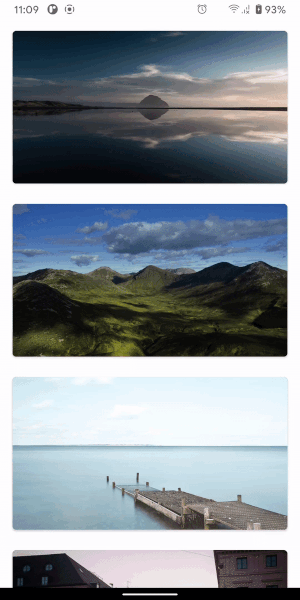

# BlurSelect - is a library for selecting view and blur all background


# Setup
## 1) App level ```build.gradle```
```
dependencies {
    implementation 'com.github.Bodiart:BlurSelect:1.4.0'
}
```
## 2) Application class
```
class App: Application() {
    override fun onCreate() {
        super.onCreate()
        BlurSelect.init(this)
    }
}
```
Dont forget to add this class in manifest (like this):
```
<application
    ...
    android:name="com.example.App"
    ...
/>
```
# Usage
Just call 
```
BlurSelect.selectView(context, selectView, viewForCard, config)
```
Where:
 - context - Application/Activity context
 - selectView - view what you want to focus
 - viewForCard - layout which you want to show after select (you can specify size as you want, or it will be calculated automatically)
 - config - ```BlurConfig``` object for determining animation durations and values, viewForCard size and other (there are some prepared configs for different animations)
