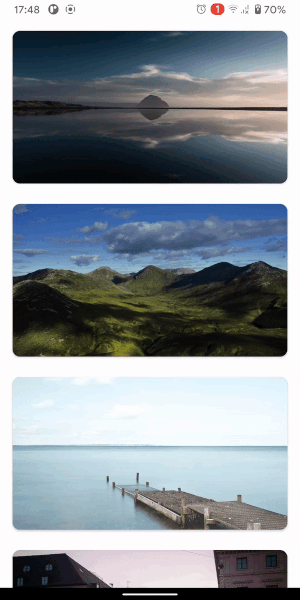
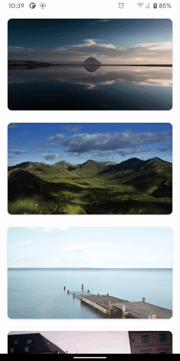

# BlurSelect - is a library for selecting view and blur background


# Setup
## 1) App level ```build.gradle```
```
dependencies {
    implementation 'com.github.Bodiart:BlurSelect:1.4.0'
}
```
## 2) Application class
```
package com.example

class App: Application() {
    override fun onCreate() {
        super.onCreate()
        BlurSelect.init(this)
    }
}
```
Dont forget to add this class in manifest (like this):
```
<application
    ...
    android:name="com.example.App"
    ...
/>
```
# Usage
Just call 
```
BlurSelect.selectView(context, selectView, viewForCard, config)
```
Where:
 - context - Application/Activity context
 - selectView - view what you want to focus
 - viewForCard - layout which you want to show after select (you can specify size as you want, or it will be calculated automatically)
 - config - ```BlurConfig``` object for determining animation durations and values, viewForCard size and other (there are some prepared configs for different animations)
 
To add viewForCard listeners:
```
val blurSelect = BlurSelect.selectView(context, selectView, viewForCard, config)
blurSelect.addCardListener(viewId, listener)
```
 
 # Prepared configs
 
 ```1) BlurConfigs.withShadowConfig(elevationFrom, elevationTo)```
 - elevationFrom - start shadow animation with this elevation
 - elevationTo - end shadow animation with this elevation
 
 Enables shadow animation.
 If you are using CardView as select view and you already have elevation, just specify
 ```
 elevationFrom = CardView.cardElevation
 ```
 
 
 
 ```2) BlurConfig.withRadiusConfig(radiusFrom, radiusTo)```
 - radiusFrom - start animation with this radius
 - radiusTo - end animation with this radius
 
 If you are using CardView as select view and you already have corner radius, just specify
 ```
 radiusFrom = CardView.radius
 ```
 
 

 ```3) BlurConfig.onlyScaleUpConfig(scaleUpTo)```
 - scaleUpTo - end scale up animation with this scale (t can be lesser than 1)
 
 
 
 ```4) BlurConfig.withShadowAndRadiusConfig(elevationFrom, elevationTo, radiusFrom, radiusTo)```
 
 

 ```5) BlurConfig.onlyScaleUpWithShadowConfig(scaleUpTo, elevationFrom, elevationTo)```
 
 
 
 ```6) BlurConfig.onlyScaleUpWithRadiusConfig(scaleUpTo, radiusFrom, radiusTo)```
 
 
 
 ```7) BlurConfig.onlyScaleUpWithShadowAndRadiusConfig(scaleUpTo, elevationFrom, elevationTo, radiusFrom, radiusTo)```
 
 
 
 # Config properties
 
 ## Blurred background
  - ```blurredBgBlurRadius``` - radius of background blur factor
  - ```blurredBgBlurDownScaleFactor``` - background view bitmap downscale factor
 ## Card (view that appears when selectView focused)
  - ```cardAutoCalculateInnerViewSize``` - auto calculate card width and height (if you want to specify size manually - set it to false)
  - ```cardTopAdditionMargin``` - additional card vertical margin
  - ```cardStartEndAdditionMargin``` - additional card horizontal margin
 ## SelectView (view for focus)
  - ```selectViewCardDuplicateCardParams``` - duplicate card view params, such as elevation, background color and radius. If selectView is CardView - it can duplicate params. Or you can set it to false and specify radius, background color and elevation (by setting shadow animation) manually
  - ```selectViewCardShadowAnimEnabled``` - enable shadow (elevation) animation. Specify ```selectViewCardAnimDurationShadowOn```, ```selectViewCardAnimDurationShadowOff```, ```selectViewCardAnimValueShadowOnFrom```, ```selectViewCardAnimValueShadowOnTo```, ```selectViewCardAnimValueShadowOffTo```
  - ```selectViewCardRadiusAnimEnabled``` - enable radius (card corner radius) animation. Specify ```selectViewCardAnimDurationRadiusOn```, ```selectViewCardAnimDurationRadiusOff```, ```selectViewCardAnimValueRadiusOnFrom```, ```selectViewCardAnimValueRadiusOnTo```, ```selectViewCardAnimValueRadiusOffTo```
